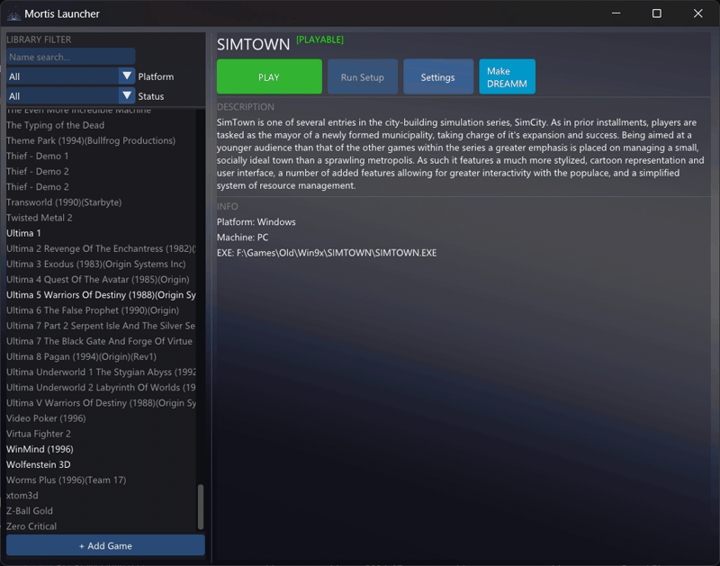

# Mortis Launcher

Mortis Launcher is a simple, easy-to-use front end for the DREAMM emulator.

If you are using the latest beta versions of DREAMM, you know it has experimental support for running DOS and Windows games. This launcher helps you organize those games into a clean library so you don't have to type out long command-line arguments every time you want to play or test support.

## What it does

### Keeps your games organized
* **Library:** Saves your list of games automatically.
* **Search:** Find games quickly by name or if they are for DOS or Windows. 
* **Filter:** Easily filter between Supported/Unsupported games.
* **Details:** Edit game titles and descriptions.

### Makes launching easy
* **One-Click Play:** Just pick a game and hit Play. The launcher handles all the mounting commands for you.
* **CD Support:** If your game uses a disc, just select it and the launcher will mount it as the D: drive automatically.
* **Suspend Mode:** When you launch a game, the launcher completely pauses itself. This means it uses 0% CPU and GPU while you play, so your game gets full performance.
* **DREAMM Detection:** Finds your currently installed library and displays them in the game list. **(0.2.5+)**

### Lets you tweak settings
* **Hardware:** Change how much RAM the emulated PC has or how fast the CPU is (MIPS).
* **Video & Audio:** Pick what kind of graphics card (VGA, SVGA, etc.) and sound card (Sound Blaster, AdLib, etc.) the game sees.
* **Resolution:** Set the window size and color depth. **(Win 16/32)**

### Developer Tools
* **Make DREAMM File:** There is a specific button to generate a `.dreamm` config file next to your game executable. This is useful if you are helping debug DREAMM or want to share a config.

### What it is **NOT**
* **An "end all, be all" Launcher:** This will only be a launcher for DREAMM. 
* **Feature Creep XL:** There will be a point where I find the features to be complete. I will adjust new releases **only** whenever there are new additions within Dreamm.